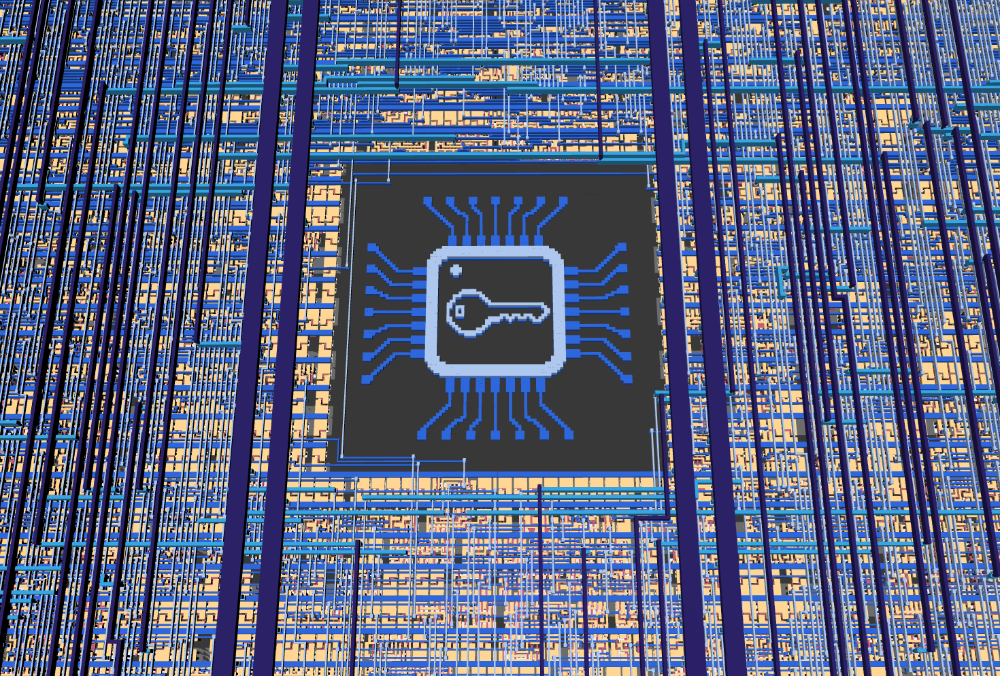

<!---

This file is used to generate your project datasheet. Please fill in the information below and delete any unused
sections.

You can also include images in this folder and reference them in the markdown. Each image must be less than
512 kb in size, and the combined size of all images must be less than 1 MB.
-->

## Introduction

This is a Tiny Tapeout ASIC project implementing the SIMON64/128 lightweight block cipher with an SPI interface.

SIMON is a family of lightweight block ciphers published by the NSA in 2013, designed for efficient hardware implementation. Its sister family, SPECK, similarly targets software efficiency.
This project implements SIMON64/128, which is a variant of SIMON using 64-bit blocks and 128-bit keys.

This project has not been hardened against side-channels or other cryptographic attacks. That could potentially be an interesting follow-up project.

The ASIC implementation also includes an image illustrating a secure chip, on metal layers 1 and 2, as can be seen in this 3D render:



## Hardware Interface

The SIMON64/128 crypto module can be used through the RP2350 microcontroller on the demo board, or by connecting an external microcontroller or SPI adapter to the SPI pins.

| Pin     | Signal       |
|---------|--------------|
| `uio[0]`| SPI CS_N     |
| `uio[1]`| SPI SCK      |
| `uio[2]`| SPI MOSI     |
| `uio[3]`| SPI MISO     |

SPI mode 0 is used, with clock polarity 0 and clock phase 0. Data is sampled (from MOSI) on rising clock edges, and shifted out (on MISO) on falling clock edges.
Chip select is active low.

An SPI clock frequency of up to 6 MHz seems to work fine, with a 50 MHz system clock, when testing on an FPGA. Results may vary on the actual ASIC.

## SPI Protocol

All SPI transfers are framed by `CS_N`.
The first byte in each SPI frame is always a command byte.

Data format:
- Multi-byte values are big-endian.
- Bits are shifted MSB-first.
- Key size is 16 bytes (128 bits).
- Block size is 8 bytes (64 bits).

### Commands

| Command | Value | MOSI data (after command) | MISO data (after command) |
|---------|-------|-----------------------------|--------------------|
| `CMD_WRITE_KEY_128` | `0x10` | 16 key bytes | - |
| `CMD_WRITE_BLOCK_64` | `0x20` | 8 data bytes (plaintext or ciphertext) | - |
| `CMD_START_ENCRYPT` | `0x30` | - | - |
| `CMD_START_DECRYPT` | `0x31` | - | - |
| `CMD_READ_BLOCK_64` | `0x40` | - | 8 data bytes (plaintext or ciphertext) |
| `CMD_READ_STATUS` | `0x50` | - | 1-byte status |

### Status Byte (`CMD_READ_STATUS`)

Status bit layout:
- bits 7:3: unused, currently set to `0`
- bit 2: `out_valid` (1 when output block is ready)
- bit 1: `core_busy` (1 while encryption/decryption is running)
- bit 0: always `1`

### Typical transaction sequence

1. Send `CMD_WRITE_KEY_128` with 16 key bytes.
2. Send `CMD_WRITE_BLOCK_64` with 8 plaintext/ciphertext bytes.
3. Send `CMD_START_ENCRYPT` or `CMD_START_DECRYPT`.
4. Poll `CMD_READ_STATUS` until bit 2 (`out_valid`) becomes `1`.
5. Send `CMD_READ_BLOCK_64` and clock out 8 bytes of result.

Notes:
- Writing a new block (`CMD_WRITE_BLOCK_64`) clears `out_valid`.
- If `CMD_READ_BLOCK_64` is issued when `out_valid=0`, output data is not valid.

## How It Works

SIMON supports multiple variants and parameter sets based on word size (n), which determines the overall block size (2n). The key size is a multiple of n by m=2, 3 or 4.

SIMON64/128 uses 32-bit words (n=32), 64-bit blocks (2n=64), and a 128-bit key (m=4) with 44 rounds.

SIMON is a balanced Feistel cipher, meaning (for SIMON64/128) the 64-bit block is split into two 32-bit halves, and each round updates one half using a nonlinear function of the other half plus a round key.
The round function consists of bitwise operations and rotations (no S-boxes), which is helpful when implementing in limited area in hardware.

The project consists of three main Verilog modules: an SPI peripheral that handles communication with an external microcontroller, a SIMON64/128 cryptographic core that performs encryption and decryption, and a top-level wrapper that integrates them.

The full key and block are loaded as bytes over SPI and stored in a 128-bit key window register (`k_window`) and 64-bit block state (split into `x_reg` and `y_reg`), but round processing itself is performed bit-by-bit over multiple cycles.

Internally, each round is executed over 32 clock cycles (`ctr_bit` from 0 to 31). At each bit step, the core computes one new bit from the SIMON round function using rotations, bitwise AND/XOR logic, and the current round-key bit.

Round keys are generated from the 128-bit key window. The key-schedule constant is C = 0xFFFF_FFFC (2^32-4 for n=32), and the schedule combines C, one z-sequence bit, and rotated/XOR-mixed key words to form the next key word.

The z-sequence (z3 for SIMON64/128) is generated using a 7-bit LFSR, which supports updating both backwards and forwards so that the key schedule can run in either direction.

A warmup phase is used to (re-)align the key schedule direction and state between encryption and decryption operations.

Both encryption and decryption take 1410 clock cycles to complete without warmup, or 1453 clock cycles with warmup.

The cryptographic implementation matches the behavior of the [simonspeckciphers](https://pypi.org/project/simonspeckciphers/) Python library, which is also verified as part of the automated tests.

## How to Test

Automated tests using [cocotb](https://www.cocotb.org/) and [pytest](https://docs.pytest.org/en/stable/) can be found under `test/`.

The easiest way to use this project is by through MicroPython on the Tiny Tapeout demo board.

After the MicroPython examples below, this section also shows how to use an external FTDI breakout board to communicate through the bidirectional Pmod header from Python scripts running on a PC.
Other external devices, such as microcontrollers or other SPI adapters, can be used in the same way.

### Using with MicroPython on the TT Demo Board

The Tiny Tapeout demo board includes an RP2350 running MicroPython, which can be used to test this project.

The full code below can also be found in `micropython/micropython_example.py`.

First, set up some utility functions:
```python
CMD_WRITE_KEY_128 = 0x10
CMD_WRITE_BLOCK_64 = 0x20
CMD_START_ENCRYPT = 0x30
CMD_START_DECRYPT = 0x31
CMD_READ_BLOCK_64 = 0x40
CMD_READ_STATUS = 0x50

def spi_write_cmd_and_payload(spi, cmd, payload=None):
    spi_cs(0)
    spi.write(bytes([cmd]))
    if payload:
        spi.write(payload)
    spi_cs(1)

def spi_read_status(spi):
    spi_cs(0)
    spi.write(bytes([CMD_READ_STATUS]))
    status = spi.read(1)
    spi_cs(1)
    return status

def spi_read_block64(spi):
    spi_cs(0)
    spi.write(bytes([CMD_READ_BLOCK_64]))
    data = spi.read(8)
    spi_cs(1)
    return data

def wait_spi_done(spi, max_polls=1000):
    for _ in range(max_polls):
        status = spi_read_status(spi)[0]
        if status & 0x1 == 0: # The low bit should always be 1
            return False
        if ((status >> 2) & 0x1):
            return True
    return False

def encrypt(spi, plaintext, key):
    spi_write_cmd_and_payload(spi, CMD_WRITE_KEY_128, key)
    spi_write_cmd_and_payload(spi, CMD_WRITE_BLOCK_64, plaintext)
    spi_write_cmd_and_payload(spi, CMD_START_ENCRYPT)
    status = wait_spi_done(spi)
    if not status:
        return b''
    return spi_read_block64(spi)

def decrypt(spi, ciphertext, key):
    spi_write_cmd_and_payload(spi, CMD_WRITE_KEY_128, key)
    spi_write_cmd_and_payload(spi, CMD_WRITE_BLOCK_64, ciphertext)
    spi_write_cmd_and_payload(spi, CMD_START_DECRYPT)
    status = wait_spi_done(spi)
    if not status:
        return b''
    return spi_read_block64(spi)
```

Secondly, initialize SPI:
```python
spi_cs = tt.pins.pin_uio0
spi_clk = tt.pins.pin_uio1
spi_mosi = tt.pins.pin_uio2
spi_miso = tt.pins.pin_uio3

spi_miso.init(spi_miso.IN, spi_miso.PULL_DOWN)
spi_cs.init(spi_cs.OUT)
spi_clk.init(spi_clk.OUT)
spi_mosi.init(spi_mosi.OUT)

spi = machine.SPI(1, baudrate=6000000, polarity=0, phase=0, bits=8, firstbit=machine.SPI.MSB, sck=spi_clk, mosi=spi_mosi, miso=spi_miso)

spi_cs(1) # Initial value for CS
```
Then test encryption and decryption:
```python
key = bytes.fromhex("1b1a1918131211100b0a090803020100")
plain = bytes.fromhex("656b696c20646e75")
expected_ct = bytes.fromhex("44c8fc20b9dfa07a")

ct = encrypt(spi, plain, key)
print("Ciphertext:", ct.hex())
assert ct == expected_ct, "Encryption failed"

pt = decrypt(spi, ct, key)
print("Decrypted plaintext:", pt.hex())
assert pt == plain, "Decryption failed"
```

### External SPI Using an FTDI Breakout Board

Before using SPI externally through the bidirectional Pmod header, ensure that the corresponding pins on the RP2350 on the demo board are set as inputs (without pull-downs or pull-ups).

Example code using the [PyFtdi](https://eblot.github.io/pyftdi/) Python library can be found in `python/pyftdi_example.py`.

All examples have been tested with the [Tigard](https://github.com/tigard-tools/tigard) FT2232H breakout board:


Running the script without parameters prints usage information:
```sh
$ uv run pyftdi_example.py
usage: pyftdi_example.py [-h] [--list-devices] [--device DEVICE] [--encrypt | --decrypt] [--key KEY] [--data DATA]
pyftdi_example.py: error: Specify one operation: --encrypt or --decrypt
```

Use `--list-devices` to find your device configuration:
```
$ uv run pyftdi_example.py --list-devices
Available interfaces:
  ftdi://ftdi:2232:TG11163f/1  (Tigard V1.1)
  ftdi://ftdi:2232:TG11163f/2  (Tigard V1.1)
```
The example code uses the FT2232H's second interface by default, but you can configure and use any compatible FTDI device by setting `--device DEVICE`.
If only one FTDI device is connected, you can also use just `ftdi:///1` for the first interface, `ftdi:///2` for the second and so on.

Set the key with `--key` and data (plaintext or ciphertext) with `--data`, and then use `--encrypt` or `--decrypt` to encrypt or decrypt data, respectively:
```sh
$ uv run pyftdi_example.py --encrypt --key 1b1a1918131211100b0a090803020100 --data 656b696c20646e75
Ciphertext: 44c8fc20b9dfa07a

$ uv run pyftdi_example.py --decrypt --key 1b1a1918131211100b0a090803020100 --data 44c8fc20b9dfa07a
Plaintext: 656b696c20646e75
```

Use a specific FTDI device like this:
```sh
$ uv run pyftdi_example.py --decrypt --device ftdi://ftdi:2232:TG11163f/2 --key 1b1a1918131211100b0a090803
020100 --data 44c8fc20b9dfa07a
Plaintext: 656b696c20646e75
```

## References

A bitserial implementation of SIMON128 has previously been taped out on [Tiny Tapeout 8](https://tinytapeout.com/chips/tt08/tt_um_simon_cipher) and [IHP 25a](https://tinytapeout.com/chips/ttihp25a/tt_um_simon_cipher), by [Secure-Embedded-Systems](https://github.com/Secure-Embedded-Systems/tt08-simon). That implementation has a fixed hardcoded (all zero) key and uses a custom 3-bit input and 2-bit output interface, but it also fits in only one Tiny Tapeout tile (instead of two, like this project).

The [simonspeckciphers](https://pypi.org/project/simonspeckciphers/) Python library was used as a reference, and is also included in the cocotb tests for this project.

The following papers were also used as references:
- [The SIMON and SPECK Families of Lightweight Block Ciphers](https://eprint.iacr.org/2013/404)
- [SIMON Says, Break the Area Records for Symmetric Key Block Ciphers on FPGAs](https://eprint.iacr.org/2014/237)
- [Simple SIMON: FPGA implementations of the SIMON 64/128 Block Cipher](https://eprint.iacr.org/2016/029)
