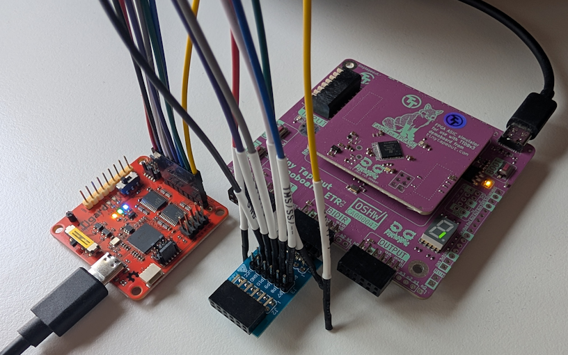

<!---

This file is used to generate your project datasheet. Please fill in the information below and delete any unused
sections.

You can also include images in this folder and reference them in the markdown. Each image must be less than
512 kb in size, and the combined size of all images must be less than 1 MB.
-->

## Introduction

This is a Tiny Tapeout ASIC project implementing the SIMON64/128 lightweight block cipher with an SPI interface.

This project has not been hardened against side-channels or other cryptographic attacks. That could potentially be an interesting follow-up project.

The ASIC implementation also includes some art of a secure chip, on metal layers 1 and 2, as can be seen in this 3D render:


## How It Works

TODO: The cryptographic implementation matches the behavior of the [simonspeckciphers](https://pypi.org/project/simonspeckciphers/) Python library, which is also verified as part of the automated tests.

## Hardware Interface

The SIMON64/128 crypto module can be used through the RP2350 microcontroller on the demo board, or optionally by connecting an external microcontroller to the SPI pins.

## How to Test

**WORK IN PROGRESS**



### Using with MicroPython on the TT Demo Board

The Tiny Tapeout demo board includes an RP2350 running MicroPython, which can be used to test this project.

First, set up some utility functions:
```python
CMD_WRITE_KEY_128 = 0x10
CMD_WRITE_BLOCK_64 = 0x20
CMD_START_ENCRYPT = 0x30
CMD_START_DECRYPT = 0x31
CMD_READ_BLOCK_64 = 0x40
CMD_READ_STATUS = 0x50

def spi_write_cmd_and_payload(spi, cmd, payload=None):
    spi_cs(0)
    spi.write(bytes([cmd]))
    if payload:
        spi.write(payload)
    spi_cs(1)

def spi_read_status(spi):
    spi_cs(0)
    spi.write(bytes([CMD_READ_STATUS]))
    status = spi.read(1)
    spi_cs(1)
    return status

def spi_read_block64(spi):
    spi_cs(0)
    spi.write(bytes([CMD_READ_BLOCK_64]))
    data = spi.read(8)
    spi_cs(1)
    return data

def wait_spi_done(spi, max_polls=1000):
    for _ in range(max_polls):
        status = spi_read_status(spi)[0]
        if status & 0x1 == 0: # The low bit should always be 1
            return False
        if ((status >> 2) & 0x1):
            return True
    return False

def encrypt(spi, plaintext, key):
    spi_write_cmd_and_payload(spi, CMD_WRITE_KEY_128, key)
    spi_write_cmd_and_payload(spi, CMD_WRITE_BLOCK_64, plaintext)
    spi_write_cmd_and_payload(spi, CMD_START_ENCRYPT)
    status = wait_spi_done(spi)
    if not status:
        return b''
    return spi_read_block64(spi)

def decrypt(spi, ciphertext, key):
    spi_write_cmd_and_payload(spi, CMD_WRITE_KEY_128, key)
    spi_write_cmd_and_payload(spi, CMD_WRITE_BLOCK_64, ciphertext)
    spi_write_cmd_and_payload(spi, CMD_START_DECRYPT)
    status = wait_spi_done(spi)
    if not status:
        return b''
    return spi_read_block64(spi)
```

Secondly, initialize SPI:
```python
spi_cs = tt.pins.pin_uio0
spi_clk = tt.pins.pin_uio1
spi_mosi = tt.pins.pin_uio2
spi_miso = tt.pins.pin_uio3

spi_miso.init(spi_miso.IN, spi_miso.PULL_DOWN)
spi_cs.init(spi_cs.OUT)
spi_clk.init(spi_clk.OUT)
spi_mosi.init(spi_mosi.OUT)

spi = machine.SPI(1, baudrate=10000, polarity=0, phase=0, bits=8, firstbit=machine.SPI.MSB, sck=spi_clk, mosi=spi_mosi, miso=spi_miso)

spi_cs(1) # Initial value for CS
```
Then test encryption and decryption:
```python
key = bytes.fromhex("1b1a1918131211100b0a090803020100")
plain = bytes.fromhex("656b696c20646e75")
expected_ct = bytes.fromhex("44c8fc20b9dfa07a")

ct = encrypt(spi, plain, key)
print("Ciphertext:", ct.hex())
assert ct == expected_ct, "Encryption failed"

pt = decrypt(spi, ct, key)
print("Decrypted plaintext:", pt.hex())
assert pt == plain, "Decryption failed"
```

## References

A bitserial implementation of SIMON128 has previously been taped out on [Tiny Tapeout 8](https://tinytapeout.com/chips/tt08/tt_um_simon_cipher) and [IHP 25a](https://tinytapeout.com/chips/ttihp25a/tt_um_simon_cipher), by [Secure-Embedded-Systems](https://github.com/Secure-Embedded-Systems/tt08-simon). That implementation has a fixed hardcoded (all zero) key and uses a custom 3-bit input and 2-bit output interface, but it also fits in only one Tiny Tapeout tile (instead of two, like this project).

The [simonspeckciphers](https://pypi.org/project/simonspeckciphers/) Python library was used as a reference, and is also included in the cocotb tests for this project.

The following papers were also used as references:
- [The SIMON and SPECK Families of Lightweight Block Ciphers](https://eprint.iacr.org/2013/404)
- [SIMON Says, Break the Area Records for Symmetric Key Block Ciphers on FPGAs](https://eprint.iacr.org/2014/237)
- [Simple SIMON: FPGA implementations of the SIMON 64/128 Block Cipher](https://eprint.iacr.org/2016/029)